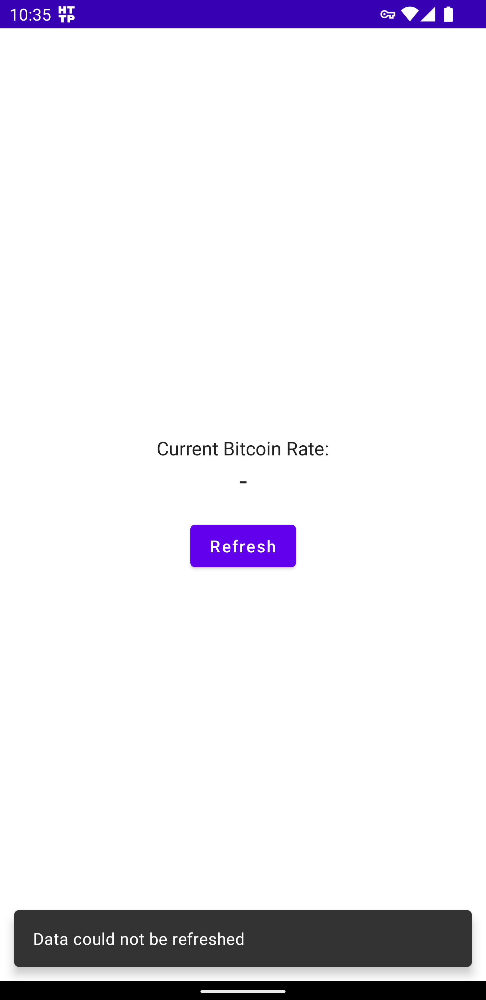

# CoWorks - Bitcoin Conversion Rate

This project is done as assesment for Android Engineer position at Coworks.

## Authors

- [Mashhood Qazi](https://github.com/mashhoodqazi93)

## Screenshots

  

## Feature and Functionality
Following are the basic functionalities that were required and have been implemented
| Requested Functionality  | Status |
| ------------- | ------------- |
| UI with Bitcoin USD rate and `Refresh` button  | DONE  |
| API integration for getting Bitcoin conversion rate to USD  | DONE  |
| Clean Architecture  | DONE  |
| Jetpack Compose used as its recommended for UI  | DONE  |
| Keep UI and Business Logic code separate  | DONE  |
| MVVM architecture with state driven UI| DONE  |
| 100% Kotlin code | DONE  |
| Used Version Control and Readme | DONE  |
| All `Lint Warnings` addressed | DONE  |

## Architecture
Overall, this project has been purely built using the guidelines provided by google.

The Architecture is based on the following points
- MVVM (Separation of UI from Business logic)
- Clean Architecture (Different layers for UI, Data and Domain)
  Note: We could use different modules for differnet architectural layers but looking at the size of this task, it would be unnecessary over engineering.

### Language and Major Libraries Used
- Kotlin
- Compose (For UI. All UI is driven by State)
- Hilt (DI)
- Retrofit

## Git Structure

This project has been properly committed and pushed on Git.
Following are some rules that were followed
- Multiple commits made in separate feature branches
- Porper commit messages added for every commit.
- Pull Requests used to merge the branches in Master branch

## Future Improvements
There are a few other items that could make this project look more complete.

- SpotLess (For ensuring code quality)
- Bitrise (For auto build generation using CI/CD pipelines)
- Unit & UI testing or using TDD approach. Currently i did not include Unit Testing as it was not requested and the estimated time mentioned in the email also suggested that it is not expected.
